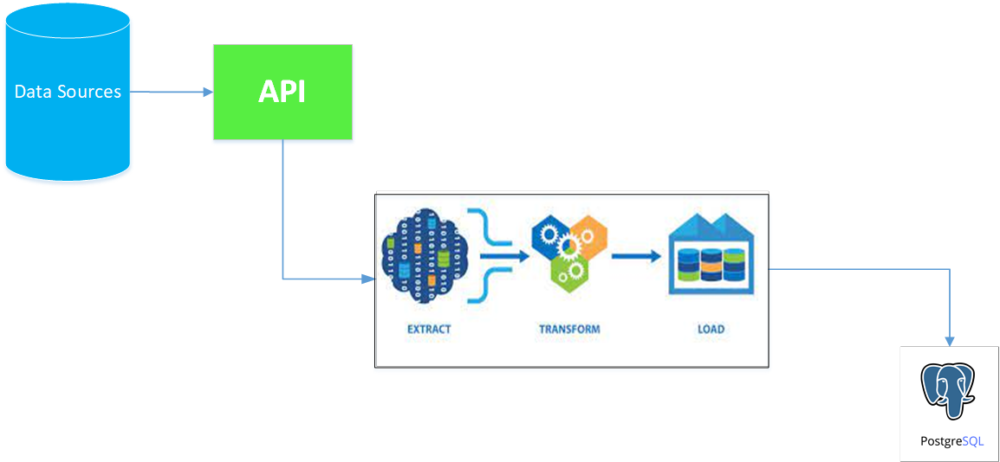

# Geospatial Data Ingestion to PostgreSQL
## Overview
This script utilizes various libraries and APIs to ingest geospatial data from different sources, such as schools, police facilities, hospitals, etc. The data is then transformed into a suitable format and loaded into a PostgreSQL database. The script automates the entire process and provides options to configure the database connection parameters.

## Workflow


## Prerequisites

Before running the script, ensure that you have the following dependencies installed:

- Python (version 3.x)
- Required Python libraries: `geopandas`, `pandas`, `sqlalchemy`, `requests`, `shapely`

You can install the required libraries using pip:

```sh
pip install geopandas pandas sqlalchemy requests shapely
```

## Usage

To run the script, use the following command:

```sh
python perth-poi-elt.py --user=<username> --password=<password> --host=<host> --port=<port> --db=<database>
```
###  Configuration

The script requires the following command-line arguments:
- `--user`: The username for the PostgreSQL database.
- `--password`: The password for the PostgreSQL database.
- `--host`: The host address of the PostgreSQL database.
- `--port`: The port number of the PostgreSQL database.
- `--db`: The name of the PostgreSQL database.

Make sure to provide the correct values for these arguments when running the script.

## Data Sources

The script uses the following data sources:

- **Schools**: [Schools List Excel](https://apps.det.wa.edu.au/publicreports/SchoolsListExcel0880.xlsx)
- **Police Facilities**: [WA Police Force Facilities](https://catalogue.data.wa.gov.au/dataset/a0a4aee4-9197-4783-a7b9-588defb1fd30/resource/a7f118b6-e215-4de0-b083-458e2e8f63ad/download/wapoliceforcefacilities_shp.zip)
- **Health Facilities**: [SLIP Health Facilities](https://services.slip.wa.gov.au/public/rest/services/SLIP_Public_Services/Health/MapServer/1/query)
- **Toilet Accessibility**: [ArcGIS Toilet Accessibility](https://services7.arcgis.com/v8XBa2naYNQGOjlG/arcgis/rest/services/INF_LOC_TOILETACCESSIBILITY_PV/FeatureServer/0/query)
- **Public Transport**: [SLIP Public Transport](https://services.slip.wa.gov.au/public/rest/services/SLIP_Public_Services/Transport/MapServer/14/query)
- **Car Parks**: [ArcGIS Car Park Centroid](https://services7.arcgis.com/v8XBa2naYNQGOjlG/arcgis/rest/services/PS_OTH_CARPARKCENTROID_PV/FeatureServer/0/query)
- **Parks**: [ArcGIS Park](https://services7.arcgis.com/v8XBa2naYNQGOjlG/arcgis/rest/services/PKS_AST_PARKS_PV/FeatureServer/0/query)
- **Wireless Points**: [ArcGIS Wireless Access Points](https://services7.arcgis.com/v8XBa2naYNQGOjlG/arcgis/rest/services/ITC_LOC_WIRELESSPOINTS_PV/FeatureServer/0/query)

Please note that these sources may change over time, and it's recommended to verify and update the links accordingly.